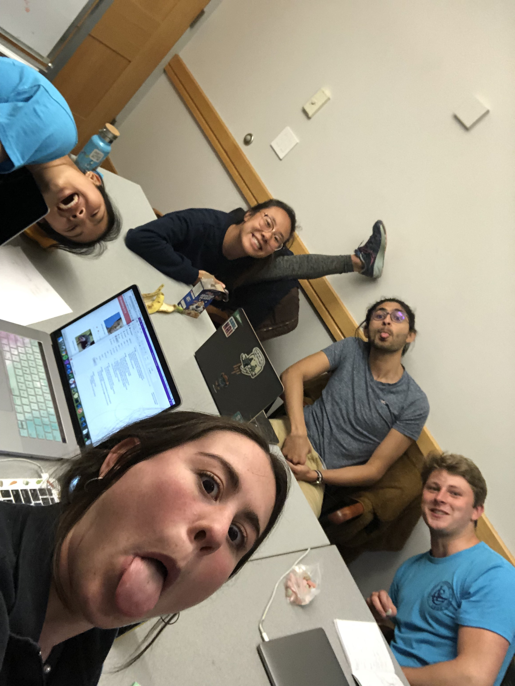

# Timeline

Have you ever felt overwhelmed or undereducated about all the opportunities available to you in life? Us too. That's why we built Timeline, a website that helps you know what you don't. This is the `backend server` that helps to power all the good stuff on http://lifetime.surge.sh/. Welcome!!!

## About 
Timeline allows you to visualize big life possibilities - think college, trade school, the army, etc - and create self-curated timelines of your future, exposing you and others to options in life you wouldn't have otherwise known about.

The main goal of Timeline is exposure rather than planning - once you know about an opportunity, there are plenty of resources to figure out how to get there. Timeline aims to overcome the problem of the "unknown unknowns," and open your mind to the many possibilities in life.

## Architecture

### API Routes
* GET ```/api/explore``` returns the root timeline element which contains the list of top level timelines under an array ```events```. [link](https://timimeline.herokuapp.com/api/explore).
* GET ```/api/timeline/:timelineId``` returns the requested timeline object. [link](https://timimeline.herokuapp.com/api/timeline/5ce1dfadf41c760034ffe52d).
* POST ```/api/timeline``` creates a new timeline object under a given parent. The post should include the req items shown on the right: 
```javascript
  timeline.title = req.body.title;
  timeline.time = req.body.time;
  timeline.cover_url = req.body.cover_url;
  timeline.level = req.body.level;
  timeline.filter = req.body.filter;
  timeline.content = req.body.content;
  timeline.parent = req.body.parentID;
```
* POST ```/api/timeline/:timelineID``` updates the timeline. Takes the same inputes in the request as the create one.
* There is also a route to create a timeline post, but it does not yet fill in the appropriate events below it nor does it go to the level above to insert its own reference in the timeline that includes it. 

Note that the database does not have all the data in it by any stretch. It does contain two paths that go to college (4yr) and work (internship). 

<details>
    <summary>Examples</summary> 

```https://timimeline.herokuapp.com/api/explore```
```json
    {
        "events": [
            {
                "_id": "5ce1dfadf41c760034ffe52d",
                "title": "Work",
                "time": "1970-01-01T10:48:00.000Z",
                "id": "5ce1dfadf41c760034ffe52d"
            },
            {
                "_id": "5ce1df40f41c760034ffe52c",
                "title": "Education",
                "time": "1970-01-01T18:00:00.000Z",
                "id": "5ce1df40f41c760034ffe52c"
            }
        ],
        "_id": "5ce1b7c6c75aa400347686ee",
        "title": "root",
        "level": 0,
        "__v": 0,
        "id": "5ce1b7c6c75aa400347686ee"
    }
```

```localhost:9090/api/timeline/5ce1c555cc465b0034eceed7```
```json
{
    "events": [
        {
            "_id": "5ce1c166cc465b0034eceecf",
            "title": "Standardized Tests",
            "time": "1970-01-01T18:00:00.000Z",
            "id": "5ce1c166cc465b0034eceecf"
        },
        {
            "_id": "5ce1c4fecc465b0034eceed0",
            "title": "Common App",
            "time": "1970-01-02T00:28:48.000Z",
            "id": "5ce1c4fecc465b0034eceed0"
        },
        {
            "_id": "5ce1c525cc465b0034eceed1",
            "title": "Letters of Recommendation",
            "time": "1970-01-02T01:55:12.000Z",
            "id": "5ce1c525cc465b0034eceed1"
        },
        {
            "_id": "5ce1c52dcc465b0034eceed2",
            "title": "FAFSA",
            "time": "1970-01-02T06:14:24.000Z",
            "id": "5ce1c52dcc465b0034eceed2"
        },
        {
            "_id": "5ce1c534cc465b0034eceed3",
            "title": "Early Decision",
            "time": "1970-01-02T04:04:48.000Z",
            "id": "5ce1c534cc465b0034eceed3"
        }
    ],
    "_id": "5ce1c555cc465b0034eceed7",
    "title": "College",
    "time": "1970-01-01T18:00:00.000Z",
    "content": "A college education can gives you ",
    "cover_url": "https://upload.wikimedia.org/wikipedia/commons/0/07/Orange_circle.png",
    "__v": 0,
    "id": "5ce1c555cc465b0034eceed7"
}
```

</details>

### Models
#### Timeline
**timeline** is the generic timeline object. It is intended to store an object that is in any level of the timeline hierarchy in the same format in case later add more levels and to simplify (hopefully) displaying these timelines. Each object contains a reference to its children ```events``` as well as information about itself. A timeline object is the following: 

```javascript
const TimelineSchema = new Schema({
  title: String,
  // array of all its children timeline objects, populated with title & time when fetched
  events: [{ type: Schema.Types.ObjectId, ref: 'Timeline' }],
  time: Date, // javascript date object (hopefully) that is just the seconds of the #months it is from start of high school
  cover_url: String, // an image url, right now these are all just orange circles
  level: Number, // this is probably unnessecary? 
  content: String,
});
```

So when you fetch either the explore page or a specific timeline you can expect a response structure of: 

```json
{
    "events": [
        {
            "_id": "5ce1c166cc465b0034eceecf",
            "title": "Standardized Tests",
            "time": "1970-01-01T18:00:00.000Z",
            "id": "5ce1c166cc465b0034eceecf"
        },
        {
            "_id": "5ce1c4fecc465b0034eceed0",
            "title": "Common App",
            "time": "1970-01-02T00:28:48.000Z",
            "id": "5ce1c4fecc465b0034eceed0"
        }
    ],
    "_id": "5ce1c555cc465b0034eceed7",
    "title": "College",
    "time": "1970-01-01T18:00:00.000Z",
    "content": "A college education can gives you ",
    "cover_url": "https://upload.wikimedia.org/wikipedia/commons/0/07/Orange_circle.png",
    "__v": 0,
    "id": "5ce1c555cc465b0034eceed7"
}
```

#### Users
The user model contains the user password as well as...

## Setup
`yarn` all the things

## Deployment
heroku git: https://git.heroku.com/timimeline.git
heroku domain: https://timimeline.herokuapp.com/

Stay tuned for the deployed site. Change the deploy URL in package.json to another surge URL and hit that `yarn deploy`.

To test locally, clone `project-api-timeline` and `project-timeline` repos. `yarn dev` it all, and mongod/mongo the backend. Frontend runs on localhost port 8080 while backend runs on 9090. 


## Authors

Abhimanyu Kapur '21

Katie Goldstein '20

Regina Yan '19

Sheppard Somers '19

Zoe Yu '19

## Sources

Code is based off Abhi's Lab 5 for backend (this) and Regina's Lab 4/5 for frontend. Unfortunately we have not populated their sources to here...so check out their assignments if you're really concerned. Generally the structure follows what was given in class and in the lab assignments for lab 5.

## Acknowledgments

TA's
Tim


